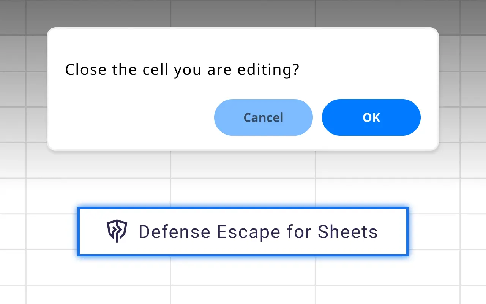

# Defence Escape for Sheets

A browser extension that guards your spreadsheet edits by showing a confirmation dialog when pressing ESC key, preventing accidental data loss in Google Sheets and Excel.

## Install

[link-chrome]: https://chromewebstore.google.com/detail/llohomkiifbjdhmjdefhpdccbkealkma 'Chrome Web Store'
[link-firefox]: https://addons.mozilla.org/en-US/firefox/addon/defense-escape/ 'Add-ons for Firefox'

[][link-chrome]
[][link-chrome]
also compatible with
[][link-chrome]
[][link-chrome]
[][link-chrome]

[][link-firefox]
[][link-firefox]

## Screenshot

## Supported Services

| App | Google Sheets | Microsoft Excel | 
| --- | :---: | :---: |
| Microsoft 365 | - | 🚧 |
| Google Drive | ⭕️ | 🚧 |
| Box | ⭕️ | 🚧 |
| Dropbox | ⭕️ | 🚧 |

## License

MIT
